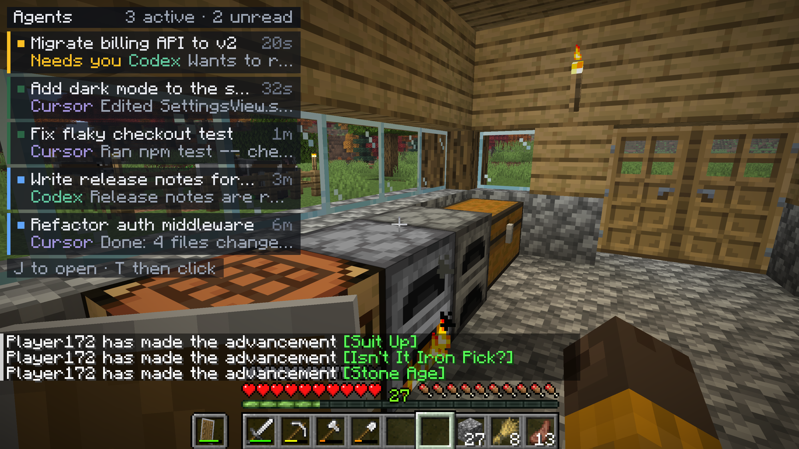
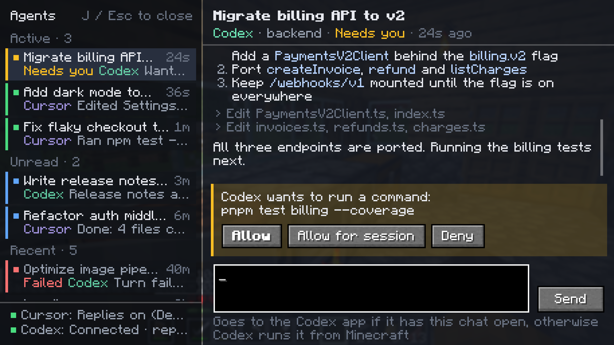
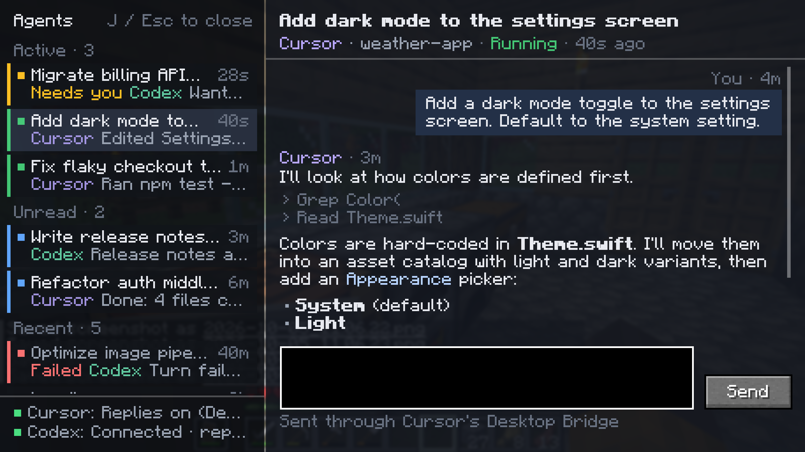
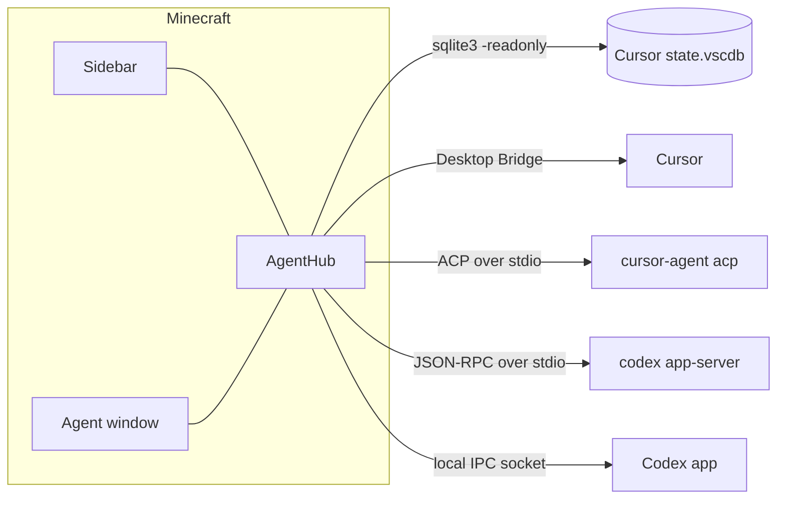

<div align="center">


# AgentMod

**Your Cursor and Codex agents, inside Minecraft.**

See what's running, read what your agents did, reply to them and start new ones without leaving your world.

[](https://www.minecraft.net)
[](https://fabricmc.net)
[](https://adoptium.net)
[](LICENSE)
[](https://github.com/FloWritesCode/agentmod/releases/latest)



</div>

## Features

- **Live sidebar** on the left edge of your screen. It lists agents that are running or need you, unread results, and anything that finished in the last 20 minutes.
- **Agent window** with the full conversation: your messages, the agent's replies (with Markdown) and every tool call it made.
- **Reply from the game.** Messages go straight to the Cursor or Codex agent.
- **Start new agents** in Cursor or Codex. Pick a project folder from the ones you use in either app (or browse to any folder), choose Agent, Plan or Ask for Cursor, and write the first message.
- **Approve commands** with Allow / Deny buttons when an agent started or resumed from the game needs permission.
- **Notifications:** a toast and a chime when an agent finishes, fails or needs your input.
- **Local only.** The mod reads your agents from this computer and makes no network requests of its own.

<table>
  <tr>
    <td width="50%"></td>
    <td width="50%"></td>
  </tr>
  <tr>
    <td align="center"><sub>Approve a Codex command without alt-tabbing</sub></td>
    <td align="center"><sub>Read a Cursor conversation and reply</sub></td>
  </tr>
</table>

## Installation

### Requirements

| What | Version |
| --- | --- |
| Minecraft | Java Edition **26.3** |
| Mod loader | [Fabric Loader](https://fabricmc.net/use/installer/) **0.19.5** or newer |
| Library | [Fabric API](https://modrinth.com/mod/fabric-api) for 26.3 |
| Agents | [Cursor](https://cursor.com) and/or [Codex](https://openai.com/codex) (desktop app or CLI), signed in on the same computer |

### Steps

1. **Install Fabric Loader.** Run the [Fabric installer](https://fabricmc.net/use/installer/), choose **Minecraft 26.3**, and click Install. This adds a `fabric-loader-26.3` profile to the Minecraft Launcher.

2. **Download the mods.**
   - AgentMod: [`agentmod-0.1.0.jar`](https://github.com/FloWritesCode/agentmod/releases/latest) from the latest release
   - [Fabric API](https://modrinth.com/mod/fabric-api/versions?g=26.3) for 26.3

3. **Put both jars in your `mods` folder.** Create it if it doesn't exist.

   | OS | Folder |
   | --- | --- |
   | macOS | `~/Library/Application Support/minecraft/mods` |
   | Windows | `%APPDATA%\.minecraft\mods` |
   | Linux | `~/.minecraft/mods` |

4. **Start the game.** In the Minecraft Launcher, pick the **fabric-loader-26.3** profile and press Play. Join any world and your agents appear on the left.

5. **Let the mod reply to Cursor agents (optional).** In Cursor, open **Settings → Beta → Desktop Bridge** and turn on **"Allow CLI to access desktop agents"**. Without it, Cursor agents are read-only in the game. Codex needs no setup.

6. **Sign in to start Cursor agents (optional).** New Cursor agents run in Cursor's CLI agent, which comes with Cursor but needs its own one-time sign-in. In the game, press <kbd>J</kbd>, click **+ New**, choose **Cursor** and click **Sign in**; finish in your browser. Running `cursor-agent login` in a terminal does the same. Starting Codex agents needs no setup.

## Usage

### Controls

| Key | Action |
| --- | --- |
| <kbd>J</kbd> | Open or close the agent window |
| <kbd>Cmd</kbd>/<kbd>Ctrl</kbd> + <kbd>N</kbd>, or **+ New** | Start a new agent (in the agent window) |
| <kbd>H</kbd> | Show or hide the sidebar |
| <kbd>T</kbd>, then click a card | Open that agent from the sidebar (the chat frees your mouse) |
| <kbd>Enter</kbd> | Send your reply |
| <kbd>Shift</kbd> + <kbd>Enter</kbd> | New line in your reply |
| <kbd>↑</kbd> / <kbd>↓</kbd> | Previous or next agent (while not typing) |
| <kbd>Page Up</kbd> / <kbd>Page Down</kbd>, mouse wheel | Scroll the conversation |
| <kbd>Cmd</kbd>/<kbd>Ctrl</kbd> + <kbd>C</kbd> | Copy the agent's last reply (while not typing) |
| <kbd>Esc</kbd> | Close the window |

You can rebind all keys under **Options → Controls → Key Binds → Agents (Cursor & Codex)**.

### The sidebar

Each card shows the agent's title, where it came from (Cursor or Codex) and what it did last. The colored bar on the left tells you its state:

| Color | Meaning |
| --- | --- |
| Green, pulsing | Running |
| Amber | Needs you: an approval or question is waiting |
| Blue | Unread: it finished since you last looked |
| Red | Failed |

Finished agents stay in the sidebar for 20 minutes, and unread ones for up to 48 hours. Opening an agent in the game marks it as read. The sidebar hides itself with the rest of the HUD (<kbd>F1</kbd>) and while the debug screen is open (<kbd>F3</kbd>).

### The agent window

Press <kbd>J</kbd> to see every agent from the last 14 days, grouped into **Active**, **Unread** and **Recent**. Select one to read the conversation. Tool calls appear as dimmed one-line summaries, and long runs of them are collapsed. The status of each connection is shown at the bottom of the list.

### Starting a new agent

Click **+ New** at the top of the agent list (or press <kbd>Cmd</kbd>/<kbd>Ctrl</kbd> + <kbd>N</kbd>), then:

1. **Choose Cursor or Codex.**
2. **Choose the project folder.** The list holds the projects you use in Cursor and Codex, newest first. Type to filter it, paste a folder path, or click **Browse…** to pick any folder.
3. **Choose a mode** (Cursor only): **Agent** edits files and runs commands, **Plan** researches and writes a plan before changing anything, **Ask** answers questions without changing files.
4. **Write the first message** and press <kbd>Enter</kbd> or click **Start agent**. Double-clicking a project also starts.

The agent window then switches to the new conversation, and the agent shows up in the sidebar like any other.

- **Codex** agents start as a new thread with your Codex settings, so they also appear in the Codex app. The turn runs from Minecraft and stops if you quit the game while it's working.
- **Cursor** agents run in Cursor's CLI agent with your Cursor account, models, rules and permission settings. They're listed as **Cursor CLI** in the game. Cursor's own sidebar doesn't show them, so you continue them from the game.

### Replying

Type in the box at the bottom and press <kbd>Enter</kbd>. Where the message goes depends on the agent:

- **Cursor:** the message is delivered through Cursor's Desktop Bridge to the open chat, as if you'd typed it there. If the agent is busy, Cursor queues it. The chat has to be open in a Cursor window.
- **Cursor CLI** (agents started from the game): the message goes to the same Cursor CLI agent. If it's still working, the message waits and is sent when the turn ends.
- **Codex:** if the Codex app has the thread open, your message goes to the app and the turn shows up there live. Otherwise AgentMod resumes the thread in its own Codex session and runs the turn from Minecraft. That turn stops if you quit the game.

### Approvals

When a Codex turn that AgentMod started wants to run a command or edit files, the agent turns amber and the window shows the request with **Allow**, **Allow for session**, **Deny** and **Deny & stop** buttons. Turns running in the Codex app keep asking for approval in the app as usual.

Cursor CLI agents ask the same way whenever your Cursor permission settings require it, with **Allow**, **Always allow**, **Reject** and **Stop**.

## Configuration

AgentMod creates `config/agentmod.json` in your Minecraft folder the first time it runs. Edit it while the game is closed.

<details>
<summary><b>All options</b></summary>

| Option | Default | Description |
| --- | --- | --- |
| `sidebarEnabled` | `true` | Show the sidebar (<kbd>H</kbd> toggles and saves this) |
| `sidebarWidth` | `168` | Sidebar width in GUI pixels |
| `sidebarScale` | `1.0` | Sidebar scale relative to your GUI scale |
| `sidebarMaxEntries` | `6` | Cards shown before "+N more" |
| `recentMinutes` | `20` | How long finished agents stay in the sidebar after you've read them |
| `unreadMaxAgeHours` | `48` | Unread agents older than this leave the sidebar (they stay in the window) |
| `windowListDays` | `14` | How far back the agent window goes |
| `pollIntervalMs` | `2500` | How often agents are refreshed |
| `toastOnFinish` | `true` | Show a toast when an agent finishes, fails or needs you |
| `soundOnFinish` | `true` | Play a chime at the same moments |
| `cursor.enabled` | `true` | Show Cursor agents |
| `cursor.stateDbPath` | auto | Path to Cursor's `state.vscdb` |
| `cursor.sqlitePath` | auto | Path to the `sqlite3` binary |
| `cursor.cliEnabled` | `true` | Start new Cursor agents with Cursor's CLI agent, and list the ones it runs |
| `cursor.cliBinaryPath` | auto | Path to `cursor-agent` (default: `~/.local/bin`, then your `PATH`, then the copy bundled with Cursor) |
| `codex.enabled` | `true` | Show Codex agents |
| `codex.binaryPath` | auto | Path to `codex` (default: the one bundled with the Codex app, then your `PATH`) |
| `codex.includeExecThreads` | `false` | Also list non-interactive `codex exec` runs |

</details>

"Unread" means an agent finished after you last opened it in the game, or Cursor marks the chat as unread. Everything from before your first launch with the mod counts as read. Read state is stored in `config/agentmod-seen.json`.

## How it works



| | Agents and status | Conversation | Replies | New agents |
| --- | --- | --- | --- | --- |
| **Cursor** | Cursor's local state database, opened read-only | Same database | Cursor's Desktop Bridge | (see Cursor CLI) |
| **Cursor CLI** | The CLI's session folder (`~/.cursor/acp-sessions`) | Replayed by `cursor-agent acp` | Same process | `cursor-agent acp`, one process per agent, started in the project folder |
| **Codex** | A private `codex app-server` started by the mod | Same app-server | The Codex app when it has the thread open, otherwise the app-server | `thread/start` in the project folder on the same app-server |

All of this happens on your computer. AgentMod never changes Cursor's database. A Cursor CLI process stops after a few idle minutes and starts again when it's needed. When Minecraft quits, AgentMod shuts down every `codex app-server` and `cursor-agent` process it started.

## Troubleshooting

<details>
<summary><b>The sidebar doesn't show up</b></summary>

The sidebar only appears when something is running, unread or finished recently. Press <kbd>J</kbd> to see all agents. If it's still missing, press <kbd>H</kbd> (it may be hidden) and make sure the HUD isn't hidden with <kbd>F1</kbd>.
</details>

<details>
<summary><b>"Read-only: Desktop Bridge is off" for Cursor</b></summary>

Turn on **Cursor Settings → Beta → Desktop Bridge → "Allow CLI to access desktop agents"**. The status line at the bottom of the agent list switches to "Replies on" within a few seconds.
</details>

<details>
<summary><b>"No open Cursor window has this chat"</b></summary>

Cursor can only deliver messages to chats that are open in a window. Open the chat in Cursor once, then send again.
</details>

<details>
<summary><b>"Not signed in" for Cursor CLI, or Start agent is greyed out</b></summary>

Cursor's CLI agent has its own sign-in. Click **+ New → Cursor → Sign in** and finish in your browser, or run `cursor-agent login` in a terminal. The game notices a terminal sign-in within about 15 seconds.
</details>

<details>
<summary><b>"Cursor's CLI agent not found"</b></summary>

AgentMod looks for `cursor-agent` in `~/.local/bin`, on your `PATH`, and inside Cursor's own install. Install the standalone CLI with `curl https://cursor.com/install -fsS | bash`, or set `cursor.cliBinaryPath` in `config/agentmod.json`.
</details>

<details>
<summary><b>"Codex CLI not found"</b></summary>

Install the Codex app or the Codex CLI. If `codex` lives somewhere unusual, set `codex.binaryPath` in `config/agentmod.json`.
</details>

<details>
<summary><b>"This thread is busy in another Codex session"</b></summary>

The thread is running in a Codex CLI session outside the Codex app, and two sessions can't write to it at once. Wait for it to finish, then reply.
</details>

## Building from source

You need JDK 25.

```sh
git clone https://github.com/FloWritesCode/agentmod.git
cd agentmod
./gradlew build        # builds build/libs/agentmod-<version>.jar and runs the tests
./gradlew runClient    # starts a development client with the mod
./gradlew installMod   # copies the jar into the macOS launcher's mods folder
```

`./gradlew test -Dagentmod.live=true` also prints what the backends see on your computer, without sending anything. `./gradlew test -Dagentmod.liveStart=codex` (or `cursor`) really starts a tiny agent in `build/live-start` and checks its reply.

The code is in `src/main/java/dev/agentmod`:

| Package | Contents |
| --- | --- |
| `cursor/` | Cursor backend (state database reader and Desktop Bridge client) and Cursor CLI backend (ACP client and session store) |
| `codex/` | Codex backend: app-server client and Codex app IPC client |
| `core/` | `AgentHub` (polling, unread tracking, notifications, starting agents) and shared models |
| `ui/` | Sidebar, agent window, new-agent screen, transcript and Markdown rendering |

## Platform support

AgentMod is developed and tested on **macOS**. The Linux and Windows paths for Cursor and Codex are wired up but untested. Bug reports and pull requests are welcome.

## License

[MIT](LICENSE). AgentMod is not affiliated with Mojang, Microsoft, Anysphere (Cursor) or OpenAI (Codex).
